# `JustWalk` - activity application
Welcome to **JustWalk** – personal fitness companion designed to monitor daily walking activities, track routes, and explore nearby places. This application was developed as part of a university project focusing on Android mobile app development.  

## **Overview**  
JustWalk is a lightweight and intuitive Android app that helps users:  
- Track daily steps, distance, and calories burned.  
- Log and visualize walking routes with GPS tracking.  
- Discover nearby points of interest.  
- Maintain a history of visited locations.  

## Showcase
Discover the diverse range of activities below, each accompanied by a corresponding image to give you a visual preview of the exciting features JustWalk has to offer.

  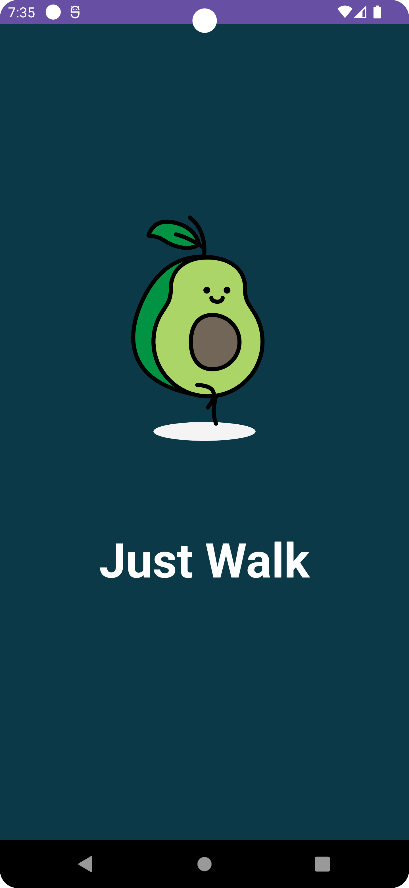
  
  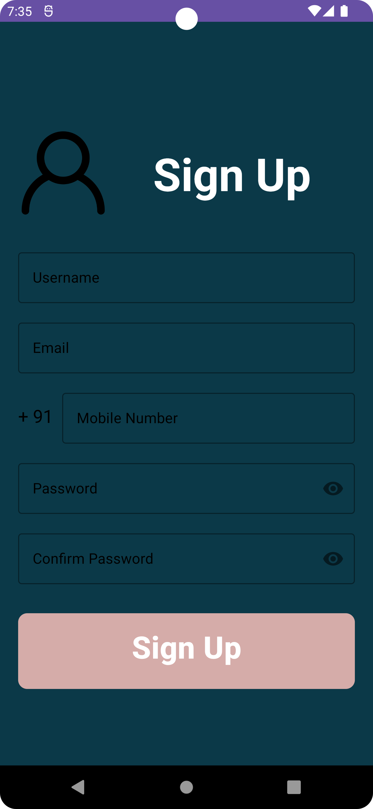
  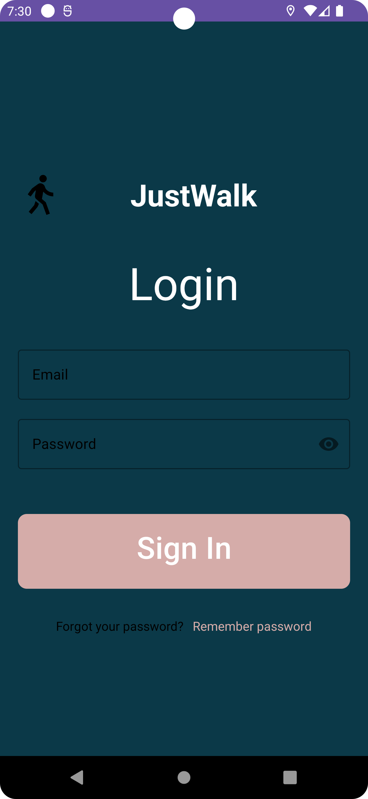

  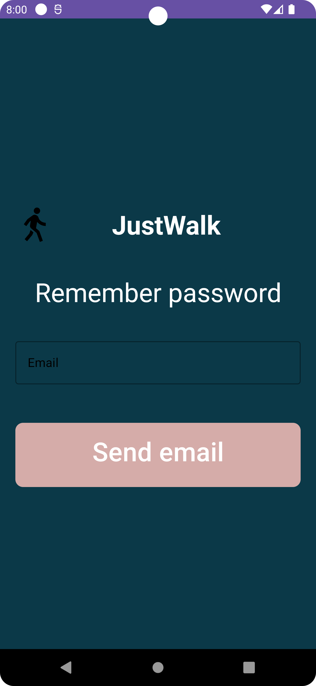
  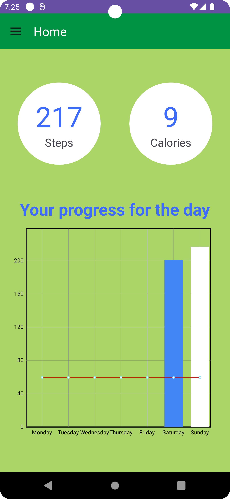
  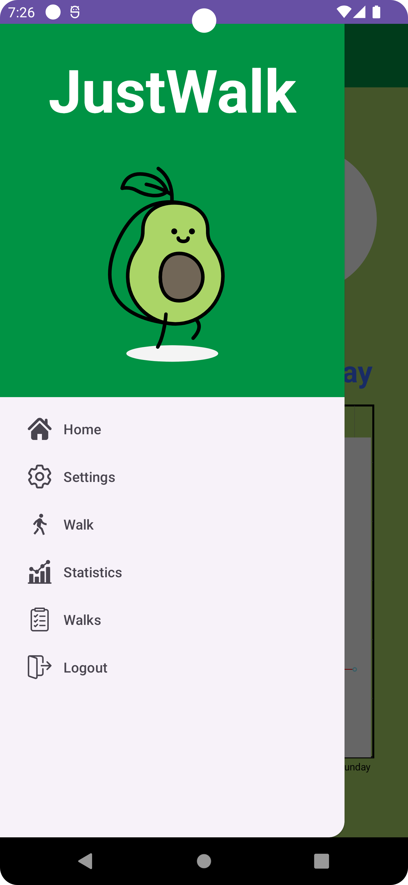
  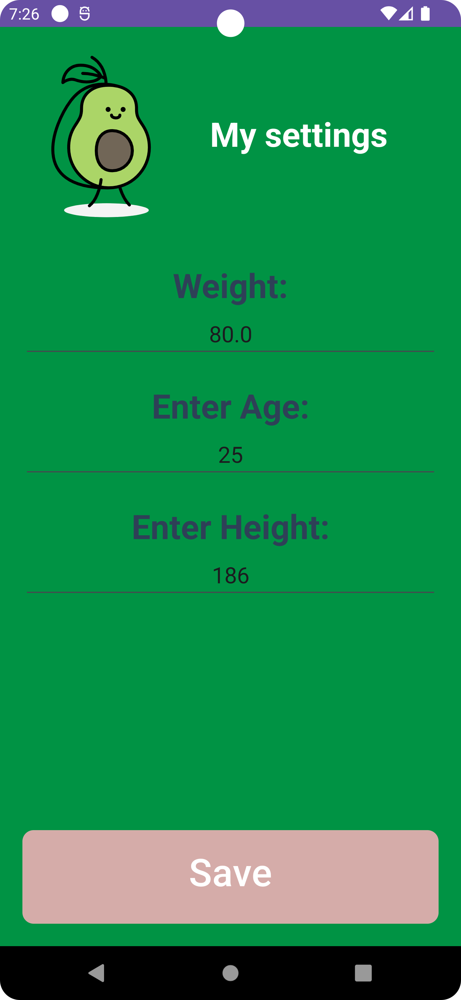

  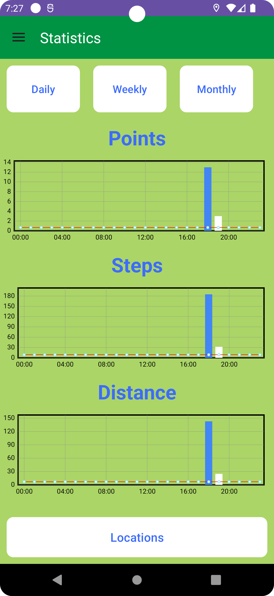
  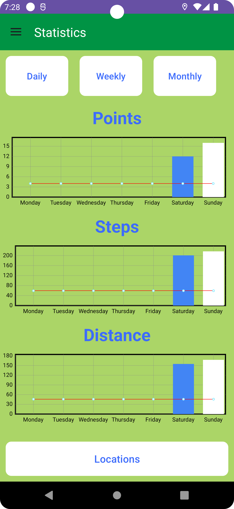
  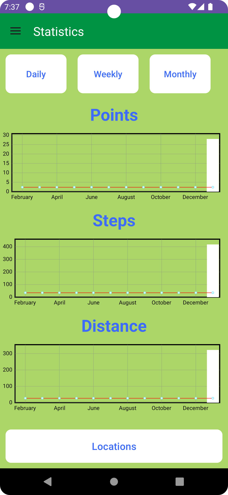
  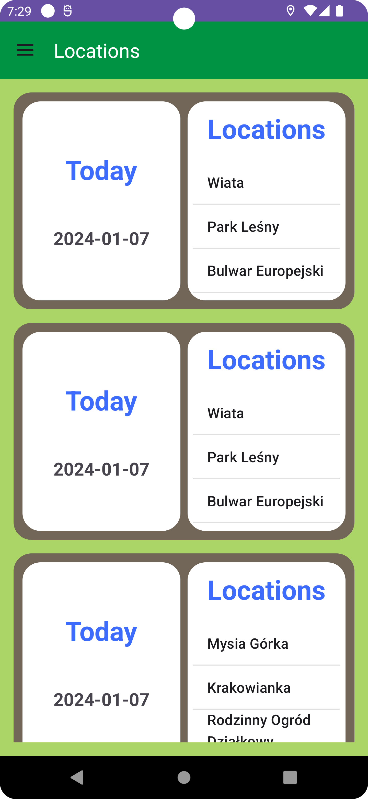

  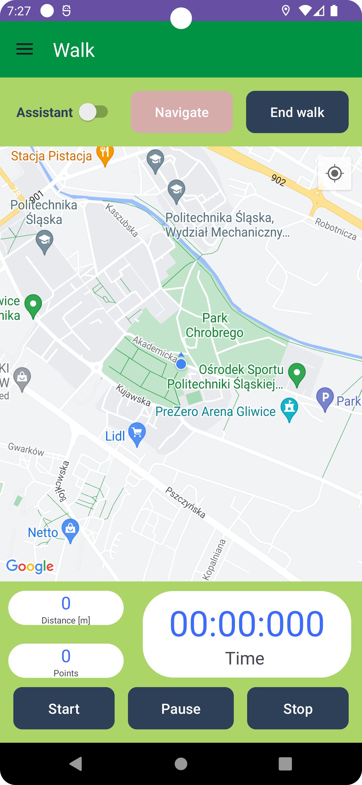
  
  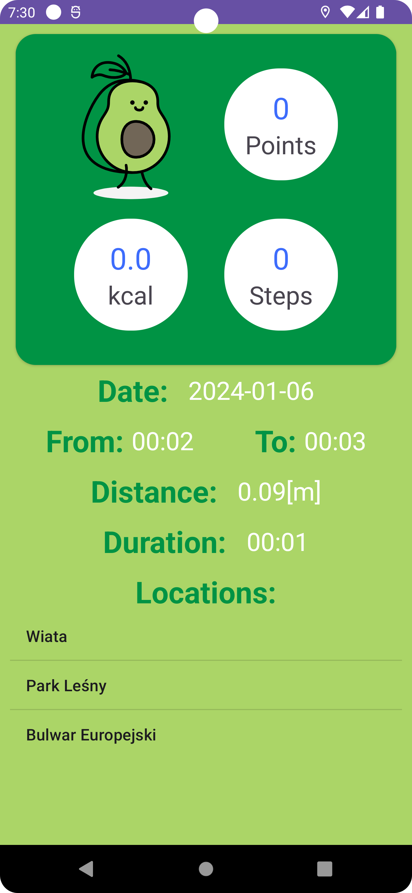

## **Key Features**  

- **Daily Activity Monitoring**  
  - Track steps, distance covered, and calories burned.  
  - View your walking history and detailed statistics to stay motivated and achieve your fitness goals.

- **Walk Route Tracking**  
  - Visualize your walks with real-time GPS tracking.  
  - Record your routes and keep a log of your walking activities.

- **Navigation Assistance**  
  - Plan your routes and navigate with ease.  
  - JustWalk ensures you never lose your way while exploring new paths.

- **Nearby Places Search**  
  - Discover parks, cafes, landmarks, and other points of interest around you – perfect for exploring your surroundings.

- **Visited Places History**  
  - Relive your adventures with a detailed log of all the places you've visited.

- **Statistics Dashboard**  
  - Access detailed and visual insights into your walking activity trends and performance.

- **Seamless Android Integration**  
  - Enjoy a user-friendly, intuitive interface designed to integrate seamlessly with your Android device.

## **Technologies**

### **Google Maps API**
JustWalk leverages the **Google Maps API** for:
- Real-time route tracking and visualization.
- Searching for nearby places like parks, cafes, and landmarks.
- Navigation assistance with accurate geolocation data.

### **Firebase**
The app integrates **Firebase** to provide:
- **Real-time database** for storing and syncing user data, such as visited places and activity logs.
- **Authentication** (if applicable) for secure user sign-in.
- **Cloud storage** for managing user-related data and resources.
- **Analytics** to track user activity and improve app performance.

