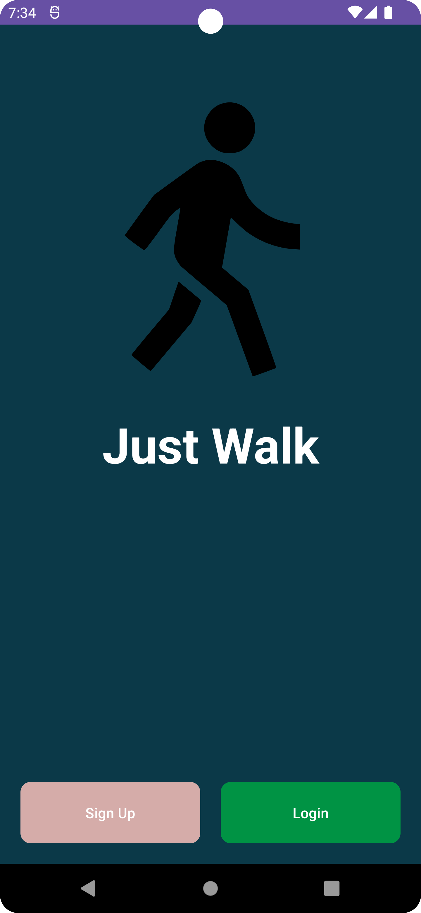

# **JustWalk** - walking monitoring application for Android

Welcome to the documentation for the JustWalk application! This project was created as part of my university assignment, focusing on the development of mobile device application.

## **Overview**
JustWalk is an Android application that serves as fitness tracking helper, offering users a way to monitor their daily activity, track walking routes, discover nearby places, and keep a record of visited locations. Whether you're aiming to stay active, explore your surroundings, or reminisce about past adventures, JustWalk has you covered. **Happy walking! - Creator**

## **Key Features**

### 1) Daily Activity Monitoring

Keep track of your daily activity, including the number of steps taken, distance covered, calories burned, and a history of places visited. JustWalk provides insightful statistics to help you stay on top of your fitness goals.

### 2) Walk Route Tracking

Record and visualize your walking routes in real-time. JustWalk utilizes GPS to track your path, providing a detailed map of your walks. This feature is perfect for fitness enthusiasts and those who want to keep a log of their walking activities.

### 3) Navigation Assistance

Navigate with ease using JustWalk's navigation feature. Plan your walk routes, and the app will guide you along the way. Never worry about getting lost again, as JustWalk helps you reach your destination efficiently.

### 4) Nearby Places Search

Discover interesting places around you. JustWalk searches for nearby points of interest, such as parks, cafes, and landmarks. Get recommendations for places to explore during your walk.

### 5) Visited Places History

Keep a record of places you've visited in the past. JustWalk maintains a history log of your visited locations, allowing you to reminisce about your favorite spots and track your explorations.

### 6) Statistics Display

Access detailed statistics about your walking activities and visited places. JustWalk provides visual insights, making it easy to understand your progress over time.

### 7) Seamless Integration

JustWalk seamlessly integrates with your Android phone, providing a user-friendly experience. The intuitive interface makes it easy for users of all levels to navigate through the app's features.

## Activities
Discover the diverse range of activities below, each accompanied by a corresponding image to give you a visual preview of the exciting features JustWalk has to offer.

| Activity                  | Image                                       |
|---------------------------|---------------------------------------------|
| Loading App Activity      |          |
| Welcome Activity           |               |
| Sign Up Activity           |                 |
| Login Activity             |                       |
| Forgot Password Activity   |    |
| Home Activity              |                       |
| Dashboard Activity         |               |
| Settings Activity          |                 |
| Daily Statistics           |          |
| Weekly Statistics          |        |
| Monthly Statistics         |       |
| Locations Activity         |              |
| Walk Activity              |                      |
| Walks Activity             |                      |
| Walks Detailed             |               |

## Configuration
The target SDK version for the JustWalk Android application is set to `34`. And minimum SDK is set to `24`.

# Resources
- [Walk Icons on Flaticon](https://www.flaticon.com/free-icons/walk)
- [LottieFiles](https://lottiefiles.com/)

# Used libraries 
## AndroidX Libraries
- `androidx.appcompat:appcompat:1.6.1`: Provides backward-compatible versions of Android UI components.
- `com.google.android.material:material:1.10.0`: Implements Material Design components and styles.
- `androidx.constraintlayout:constraintlayout:2.1.4`: Manages complex layouts in Android applications.

## Firebase
- `com.google.firebase:firebase-database:20.3.0`: Integrates Firebase Realtime Database to store and sync data.
- `com.google.firebase:firebase-auth:22.3.0`: Provides Firebase Authentication for user sign-in.

## Google Play Services
- `com.google.android.gms:play-services-maps:18.2.0`: Allows integration with Google Maps services.

## Testing Libraries
- `junit:junit:4.13.2`: Framework for writing and running tests in Java.
- `androidx.test.ext:junit:1.1.5`: AndroidX extension for JUnit.
- `androidx.test.espresso:espresso-core:3.5.1`: Testing framework for UI tests on Android.

## Animation
- `com.airbnb.android:lottie:6.2.0`: Airbnb's Lottie library for rendering After Effects animations in real-time.

## Maps
- `com.google.maps:google-maps-services:2.2.0`: Google Maps Services for Android applications.

## Location
- `com.google.android.gms:play-services-location:21.0.1`: Google Play services for location-based services.

## Places
- `com.google.android.libraries.places:places:3.2.0`: Provides functionality related to places, such as searching for places and retrieving place details.

## Graph
- `com.github.PhilJay:MPAndroidChart:v3.1.0`: MPAndroidChart library by PhilJay for creating various types of graphs and charts.
